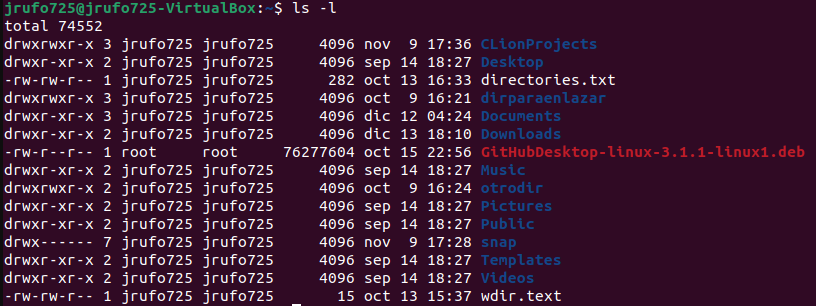

# SSRF

<figure><figcaption></figcaption></figure>

Un Server Side Request Forgery ocurre cuando una aplicación web permite hacer consultas HTTP del lado del servidor hacia un dominio arbitrario elegido por el atacante. Esto le permite al atacante hacer conexión con servicios de la infraestructura interna donde se aloja la web y exfiltrar información sensible.

Algunos ejemplos de esta vulnerabilidad son:

* Explorar directorios privados del servidor
* Ejecución remota de código en el servidor de destino
* Acceso a máquinas locales detrás del firewall de la red (escaneos de puertos)

Un tipo de acción no autorizada que merece especial atención es cuando el atacante se aprovecha del servidor vulnerable como un trampolín para permitir ataques compuestos más grandes, en particular combinaciones de SSRF y [XXE](xxe.md).

## Tipos de SSRF

* Basic SSRF
  * Full Response
  * Limited or No Response&#x20;
* Blind SSRF

### Basic SSRF

Este es el tipo de SSRF en el que el servidor de la víctima devuelve datos al atacante. Este tipo aparece cuando el hacker quiere obtener datos del servidor o quiere acceder a funciones no autorizadas.

### Blind SSRF

Como su nombre indica, en este tipo de SSRF, los atacantes no obtienen datos del servidor. Esto se ve comúnmente cuando la solicitud es sólo para desencadenar alguna acción en el servidor de la víctima sin devolver nada al servidor solicitante.

## Cómo prevenir ataques SSRF

* Whitelisting: Solo permite que se utilicen algunos `domain names` en la solicitud.
* Blacklisting: Bloquear el acceso a direcciones IP internas, dominios o palabras clave.
* Restricted Content-Type, extensions or characters: Solo permitir un tipo de archivo en particular.
* No Response: Es posible que no podamos ver la respuesta de la solicitud.
