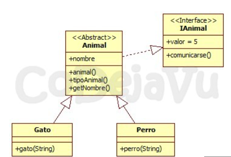

# Herencia

La herencia en Java es uno de sus puntos más interesantes, ya que nos permite crear clases hijas que mantengan la funcionalidad de su clase padre y añadir una extra.

Podemos crear objetos de estas clases hijas que cuenten con un funcionamiento más específico del que han heredado.

Las clases hijas heredan todo de la clase padre, pero solo tendrán acceso a la vista pública de este.

Gracias a esto contamos con una buena estructuración a la hora de crear un proyecto de programación [orientada a objetos.](orientacion-a-objetos.md)

