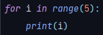
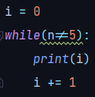

# Bucles

En Python contamos con dos tipos de bucles: _**For**_ y ** **_**While**_**.**&#x20;

Estos funcionan de manera similar a los otros lenguajes pero su sintaxis es un poco diferente.

## Bucle For

El funcionamiento de este bucle es similar al bucle For de otros lenguajes pero su sintaxis tiene algunas peculiaridades.&#x20;

Para definir un bucle for es necesario defenir una variable la que cual servira como contador  y cuantas iteraciones tendrá el bucle utilizando la función _`range`_. A esta función le deberemos pasar un iterable, es decir o un numero o una estructura de datos.

Un ejemplo de uso es el siguiente:

## Bucle While

A diferencia del bucle For, el bucle While funciona y se define igual que en otros lenguajes de programación. Se le pasará una condición y mientras esta se cumpla, se realizara una iteración.

Un ejemplo de usa será el siguiente:

