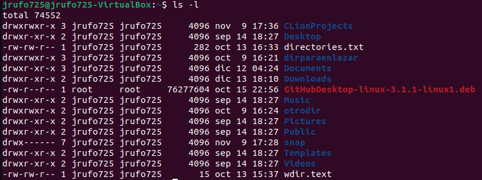

# Estructuras de datos

Una de las mayores comodidades que presenta Python es la implementación de estructuras de datos por defecto, sin necesidad de crear todas sus funcionalidades desde cero. Para empezar, una estructura de datos es una forma de organizar datos de forma categórica, por ejemplo, en listas, conjuntos, diccionarios, como explicaremos a continuación.

## Listas

Una lista es un compendio ordenado de elementos que contiene datos de cualquier tipo que se desee. A diferencia de los arrays vistos en [variables.md](../lenguaje-c/variables.md "mention") de C, no es necesario declarar el tipo de los elementos que se vayan a almacenar, ni especificar un tamaño fijo. De lo contario, bastará con añadir los elementos contenidos en una variable con el método `.append()`, donde el contenido del método será la variable o dato a introducir.

Una lista se puede declarar de dos maneras tal que así:

`my_list = []`

`my_list = list()`

Y para añadir la variable var, que contiene un número, se haría así:

`var = 3`

`my_list.append(var)`

Para acceder a un elemento concreto, se busca por índice prácticamente igual que en C (empezando por 0, hasta tamaño - 1), con la ventaja de que aquí sí que se pueden usar índices negativos para ir en orden inverso (de final a principio, desde -1 hasta -tamaño).

Por ello, si tenemos una lista con 5 elementos, `list[0]` y `list[-5]` nos devuelven el primer elemento, `list[1]` el segundo, y `list[-1]` el último.

## Conjuntos

Un conjunto es una estructura no ordenada de elementos. Su acceso por índice también es posible, pero no se garantiza la posibilidad de que éste sea ordenado en ningún momento, ni se puede usar el método `.sort()`. Sin embargo, nos es verdaderamente útil por su característica rapidez a la hora de encontrar elementos que estén contenidos en él. Por ello cuando lo usamos como iterable en un bucle (ver [bucles.md](bucles.md "mention") de este bloque de Python), si usamos la condición "in" o "not in iterable" se consiguen comprobaciones muy breves, sin necesidad de recorrer la estructura entera para buscar si el elemento está contenido.

Si volvemos al ejemplo del bloque introductorio:

La primera línea de las sentencias dentro del primer bucle "for" está preguntando si el valor de la variable "node" no se encuentra dentro del conjunto "visited", para después, de ser así, añadirlo con el método `.add()`.

## Diccionarios

