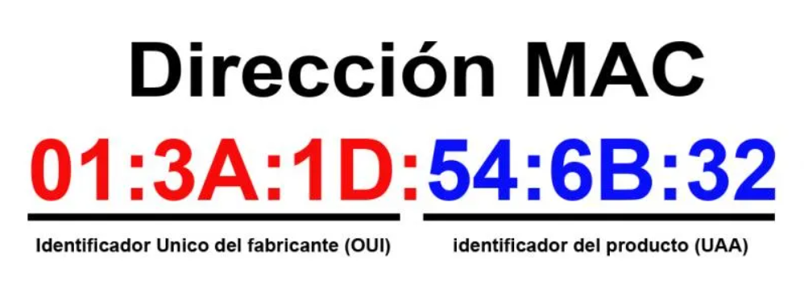

# ¿Qué es una MAC?

A diferencia de las direcciones IP, las direcciones MAC son fijas.&#x20;

Las direcciones MAC son un identificador físico único que cada fabricante le asigna a una tarjeta de red.

Esto no significa que cada dispositivo tiene una dirección MAC, ya que hay algunos que cuentan con distintas tarjetas de red por lo que tendrán direcciones diferentes dependiendo de como se conecten a la red.

Estas direcciones están formadas por 48 bits, representadas normalmente en hexadecimal de la siguiente manera:

<figure><figcaption></figcaption></figure>

Podemos ver como los 6 primeros digitos indican el fabricante y los otros 6 el modelo.

